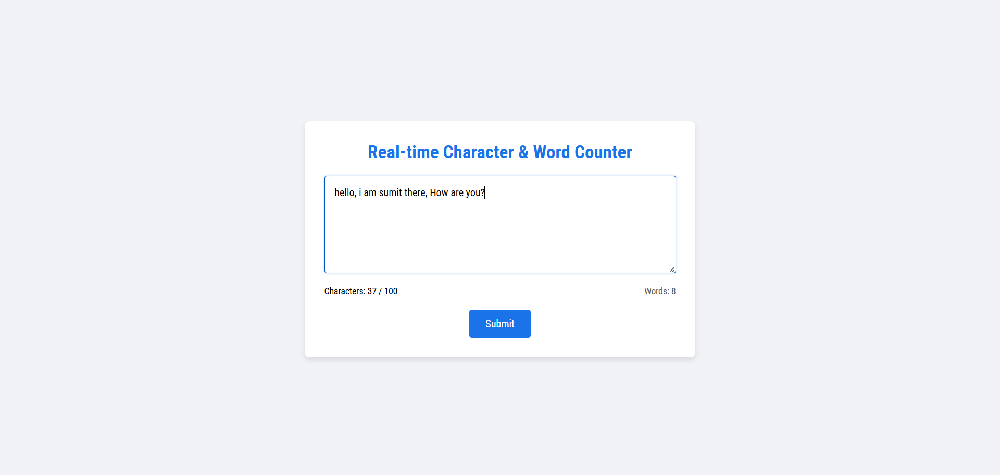

# Real-Time Character & Word Counter ✍️

This is a simple real-time character and word counter built using HTML, CSS, and JavaScript. It helps users see how many characters (up to 100) and words they’ve typed in a textarea — live as they type.

## 🔍 Features

- Live character count (with limit warning after 90 characters)
- Real-time word counter
- Disabled submit button until valid input
- Clean and responsive UI
- Smooth hover and focus states

## 💡 What I Learned

✅ How to use:
- `addEventListener()` for handling user input  
- `filter()` to remove extra spaces while counting words  
- Ternary operator for conditionally changing styles  
- How `textarea` works with attributes like `maxlength`, `rows`, and `placeholder`  
- How to enable/disable a button based on input validity

This project really helped me understand how to interact with DOM elements and manage input dynamically in real-time.

## 🖼️ Preview

## 🛠️ Tech Stack

- HTML5
- CSS3
- JavaScript (Vanilla)

---

Thanks for checking this out! 🙂
